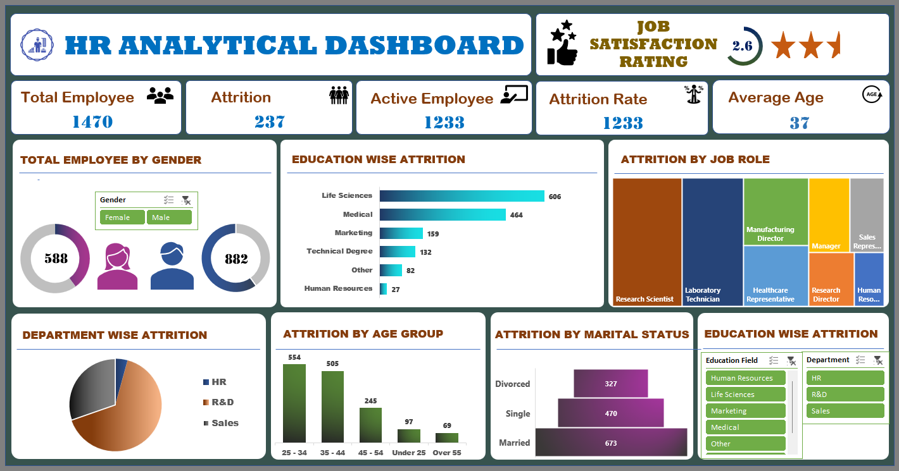

📊 Interactive Excel dashboard for HR Analytical Dashboard

A visually interactive HR Analytical Dashboard that provides valuable insights into employee attrition, job satisfaction, age distribution, education background, and more. This dashboard helps HR professionals and decision-makers monitor workforce trends and make data-driven decisions.

## Features
- Data Cleaning & Preprocessing
- Interactive Dashboard with Filters
- Key Performance Metrics Visualization

## Files
- Blinkit_Dashboard.xlsx → Main Excel dashboard
- Dataset/ → Cleaned dataset used
- Images/ → Dashboard screenshots

## Preview

